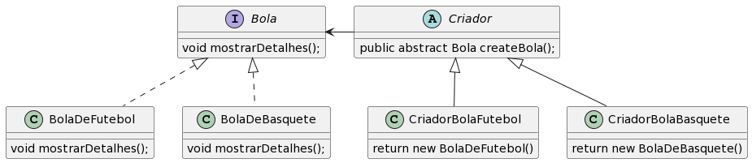

# Factory Method

## Intenção

Definir uma interface para criar um objeto, mas deixar as subclasses decidirem que classe instaciar. O Factory Method permite adiar a instaciação para subclasses.

## Motivação

1. Escalar a aplicação encapsulando a criação de objetos em uma classe separada. Permite que a lógica de criação seja alterada sem afetar o restante do código;
2. Utilizado em situações em que a criação de objetos é complexa ou pode mudar com o tempo;

## Estrutura



## Participantes

**Bola** define uma interface, a ser implementada nos produtos que serão gerados, sendo **BolaDeFutebol** e **BolaDeBasquete** os produtos. **Criador** é uma classe abstrata, que define um comportamento cuja intenção é criar um novo objeto do tipo **Bola**, esta classe é estendida por **CriadorBolaFutebol** e **CriadorBolaBasquete**, ambas têm um método herdado de **Criador** cujo retorno será um objeto do tipo **BolaDeFutebol** e **BolaDeBasquete**, respectivamente.

## Exemplo de código

```codigo
public interface Bola {
    void exibirDetalhes();
}

```

## Aplicabilidade

Use o padrão Factory Method quando:

1. uma classe não pode antecipar a classe de objetos que deve criar;
2. uma classe quer que as subclasses especifiquem is objetos que cria;
3. classes delegam responsabilidade para uma dentre várias subclasses auxiliares, e você que localizar o conhecimento de qual subclasse auxiliar que é a delegada;
