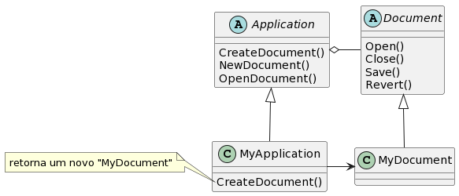

# Factory Method

## Intenção

Definir uma interface para criar um objeto, mas deixar as subclasses decidirem que classe instaciar. O Factory Method permite adiar a instaciação para subclasses.

## Motivação

Os *frameworks* usam classes abstratas para definir e manter relacionamentos entre objetos. Um *framework* é frequentemente responsável também pela criação desses objetos.
Considere um *framework* para aplicações que podem apresentar múltiplos documentos para o usuário. Duas abstrações-chave nesse *framework* são classes Appliclation(aplicação) e Document(documento). **As duas classes são abstratas**, e os clientes devem prover subclasses para realizar suas implementações específicas para a aplicação. Por exemplo, para criar uma aplicação de desenho, definimos as classes DrawingAplication e DrawingDocument. **A classe Applicarion é responsável pela administração de Documents e irá criá-los conforme exigido**- quando o usuário seleciona Open(abrir)ou New(novo), por exemplo, num menu.
Uma vez que a subclasse Document a ser instaciada é a própria da aplicação específica, **a classe Applicarion não pode prever a subclasse de Document a ser instanciada**- a classe Application somente sabe *quando* um documento deve ser criado, e não *que tipo* de Document criar. Isso cria um dilema: o *framework* deve instaciar classes, mas ele somente tem conhecimento de classes abstratas, as quais não pode instanciar.
O padrão Factory Method oferece uma solução. Ele encapsula o conhecimento sobre a subclasse de Document que deve ser criada e move este conhecimento para fora do *framework*.



As subclasses de Apllication redefinem uma operação abstrata CreateDocument em Application para retornar a subclasse apropriada de Document. Uma vez que a subclasse de Application é instanciada, pode então instanciar Documents específicos da aplicação sem conhecer suas classes. Chamamos de CreateDocument um **factory method** porque ele é resonsávek pela "manufatura" de um objeto.

## Estrutura


## Participantes

**Bola** define uma interface, a ser implementada nos produtos que serão gerados, sendo **BolaDeFutebol** e **BolaDeBasquete** os produtos. **Criador** é uma classe abstrata, que define um comportamento cuja intenção é criar um novo objeto do tipo **Bola**, esta classe é estendida por **CriadorBolaFutebol** e **CriadorBolaBasquete**, ambas têm um método herdado de **Criador** cujo retorno será um objeto do tipo **BolaDeFutebol** e **BolaDeBasquete**, respectivamente.

## Exemplo de código

```java
public interface Ball {
    void showDetails();
}


public class BasketBall implements Ball {

    private String marca;
    private String nivel;
    private int circunferenciaMin;
    private int peso;
  
    @Override
    public void showDetails() {
        System.out.println("Bola de basquete criada!");
    }

    //getters and setters

}


public class SoccerBall implements Ball {

    private String marca;
    private String nivel;
    private int circunferenciaMin;
    private int peso;

    @Override
    public void showDetails() {
        System.out.println("Marca: "+ this.marca);
        System.out.println("Nível: "+this.nivel);
        System.out.println("Circunferência: "+this.circunferenciaMin);
        System.out.println("Peso: "+this.peso);
    }


    public String getMarca() {
        return marca;
    }

    public void setMarca(String marca) {
        this.marca = marca;
    }

    public String getNivel() {
        return nivel;
    }

    public void setNivel(String nivel) {
        this.nivel = nivel;
    }

    public int getCircunferenciaMin() {
        return circunferenciaMin;
    }

    public void setCircunferenciaMin(int circunferenciaMin) {
        this.circunferenciaMin = circunferenciaMin;
    }

    public int getPeso() {
        return peso;
    }

    public void setPeso(int peso) {
        this.peso = peso;
    }
    
}

public abstract class MultiSportCourt  {
    public abstract Ball createBall();

    public void bolaGerada(){
        System.out.println("Bola criada");
    }
}


public class SoccerBallCreator extends MultiSportCourt{

    @Override
    public Ball createBall() {
        return new SoccerBall();
    }
    
    public void bolaGerada(){
        System.out.println("Bola em quadra!");
    }
}


public class BasketBallCreator extends MultiSportCourt {

    @Override
    public Ball createBall() {
        return new BasketBall();
    }    
}

public class Principal {
    public static void main(String[] args) {
       
        MultiSportCourt bolaDeFutebol= new SoccerBallCreator();

        SoccerBall bola = (SoccerBall) bolaDeFutebol.createBall();   

        bola.setMarca("Addidas");
        bola.setNivel("Amador");
        bola.setCircunferenciaMin(75);
        bola.setPeso(700);

        bola.showDetails();
        bolaDeFutebol.bolaGerada();
    
    }
}

```

## Aplicabilidade

Use o padrão Factory Method quando:

1. uma classe não pode antecipar a classe de objetos que deve criar;
2. uma classe quer que as subclasses especifiquem os objetos que criam;
3. classes delegam responsabilidade para uma dentre várias subclasses auxiliares, e você que localizar o conhecimento de qual subclasse auxiliar que é a delegada;

## Como implementar

1. Todos os produtos precisam implementar a mesma interface, nela deve ser declarado todos os métodos que fazem sentido para todos os produtos;

2. É necessário adicionar um método *fábrica vazio* na classe *criadora*, o tipo de retorno desse método deve corresponder à interface comum implementado pelos produtos;

3. Na classe *criadora*, substitua todas as referências aos construtores de *produtos* por chamadas ao método fábrica;

4. Crie um conjunto de subclasses criadoras para cada produto listado no método fábrica. Sobrescreva o método fábrica nas subclasses e adapte para que atenda o que a subclasse propõe.

## Referências

- GitHub - DavidAnson/markdownlint at v0.31.1. Disponível em: <https://github.com/DavidAnson/markdownlint/tree/v0.31.1>. Acesso em: 2 out. 2023.

- Factory Method Pattern. Disponível em: <https://www.linkedin.com/pulse/factory-method-pattern-r%C3%B4mulo-pereira/?originalSubdomain=pt>. Acesso em: 2 out. 2023.

- Gamma, E., Helm, R., Johnson, R., & Vlissides, J. (1994). Design Patterns: Elements of Reusable Object-Oriented Software. Addison-Wesley.

- Factory Method. Disponível em: <https://refactoring.guru/pt-br/design-patterns/factory-method>.
‌
